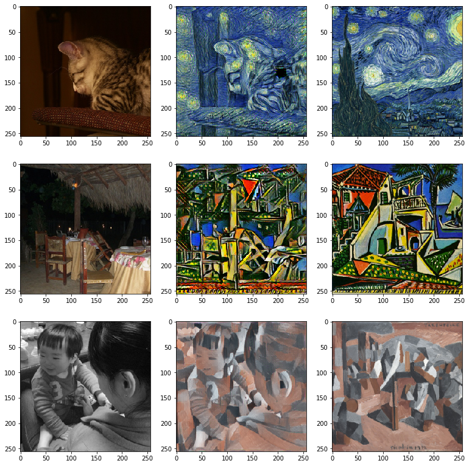

# Real Time Style-Transfer
`STILL IN PROGRESS... ALMOST DONE`

This is an implementation of Realtime Style-Transfer based on this [paper](https://arxiv.org/pdf/1603.08155)

ALmost any large image dataset would work for this, I've been using [PASCAL VOC](http://pjreddie.com/media/files/VOCtrainval_06-Nov-2007.tar)

# Code Usage

Usage instructions found here: [user manual page](USAGE.md).

# Example Results
## Pascal VOC
#### (1: Input Image  — 2: Generated Image — 3: Style Image)

